# Using NLP to Analyze Literary Trends

## Project By: Daria Senchylova, Denise Chan, Neda Mohammadi, Tann Nguyen, Trisha Agrawal

## Project Summary
In this project, we utilized Natural Language Processing (NLP) to understand how sentence length varied between the 1800s and present day. We also analyzed how the ratio of nouns, verbs, adjectives, and adverbs changed in an average sentence over the eras. 
For our analysis, we built a KNN algorithm that is able to predict what era a particular text belongs to based on the number of nouns per sentence. While this model can be built around any part of speech, we found that the number of nouns per sentence is the most accurate metric, as it is very distinct for different eras. That is, the number of nouns is negatively correlated with years, as will be seen in some visualizations.
Moreover, we were able to develop a Naive Bayes’ algorithm that can predict which year a book may have been released when the algorithm is given a value for average sentence length and average noun usage. We were also able to develop a KNN algorithm that can predict what era text came from based on the average noun use and sentence length. Finally, we also developed a linear regression model that can predict the year a novel came from based on the average noun usage.

## Data Collection and Data Cleaning               
We needed to create our own dataset as there wasn’t an existing one to work with that fit our data. We did this by copying and pasting different books into a shared excel file, which we would later download as a .csv file. First we decided to split up the eras between the five group members: 1800 to 1860, 1860 to 1914, 1914 to 1939, 1939 to 1960, and 1960 - present day. We decided to sample five novels from each era, and collected the first two chapters of each novel to maintain consistency. We didn’t sample any poems or songs as this would skew our sentence length data. We created different columns on our excel sheet to hold important information such as year of publication and author, which kept our data organized and made it easier to analyze data afterwards. 

All of our data was raw data, so data cleaning was a very important process to ensure our algorithm could properly take in the data. Before using code to clean the data, we had to manually extract any dialogue from our excerpts, as short dialogues, such as a simple “Yes.” would skew our sentence length data. Our goal was to change the data to be as simple as possible. To start off, we changed all of the characters to lowercase. We got rid of any and all punctuation that didn’t signify the end of a sentence. This included the strings “Mr./Mrs./Ms.” as the algorithm would assume the period signified the end of a sentence. We also had to account for different variations of punctuations, because when we copied and pasted from different sites, some used double left quotation marks, double right quotation marks, and vertical quotation marks. Our algorithm was then able to read in our data, sentence by sentence, without any issues.  

## Exploratory Data Analysis (EDA)

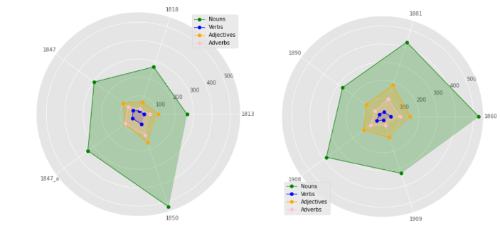
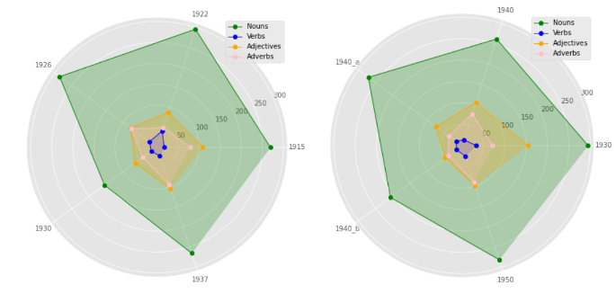
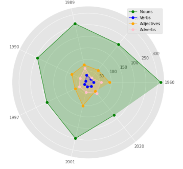

Analysis: 
The spider charts give a visual representation of the ratio of different parts of speech during different eras. This is very useful for quickly detecting any outliers and grasping an overall idea of changing trends. In our case, it was very helpful to detect overall consistency in the ratio of different parts of speech, and how the overall patterns were changing. 
For instance, over time, an average sentence would have a lower number of nouns and adjectives.
 It is also interesting to note that the number of nouns per an average sentence decreased over time. The number of adverbs fluctuates over time and it is difficult to detect a particular trend in them. These conclusions corroborate our initial hypothesis that over time there would be fewer parts of speech per sentence, as the grandiloquent style of writing was becoming less and less common between 1914 and 2022, and this ties directly to decrease in sentence length. 
When drawing such conclusions, it is also important to take into account the number of samples. Due to timing constraints, we were able to only have 1-3 samples for each year and some of the novels may not be very representative of the writing style during that era and, therefore, be an outlier. 

### Bar Graphs
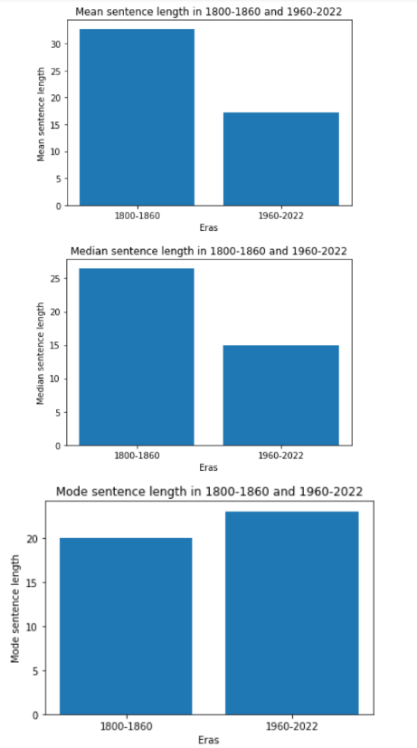

Analysis:
We decided to include different metrics for sentence length for a better overall idea of writing style in 1800-1860 and 1960-2022. These two eras have the most difference in them and, therefore, are the most appropriate for visualization for the drastic change that occurred in a century. It is important to note that our data was not too skewed by outliers as mean and mode for the two eras seem to have the same ratio. These visuals confirm our initial hypothesis that sentence length decreased over time. 

Mean: For the 1800-1860 time frame, the average sentence length is 33 words and for 1960-2022, it is ~17 words. Thus, average sentence length nearly halved within a little more than a century.

Median: As with mean, median sentence length for 1960-2022 is a little more than half of the median sentence length for 1800-1860. 

Mode: This metric is much more interesting because it shows that the sentence length that occurs the most in 1960-2022 is ~23 words, while the most common sentence length for 1800-1860 is 20 words. However, the difference is not very significant, and we can conclude that while there are certain trends regarding sentence length, the most common sentence length fluctuates around 20 words per sentence and this has been consistent for more than two centuries.

### Heat Map
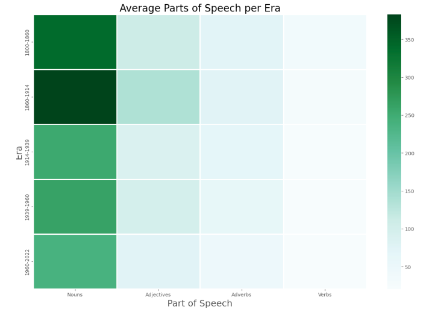

Analysis: 
This heat map shows the distribution of parts of speech throughout the different eras. To get the numbers, we used chunking to tag nouns, adjectives, adverbs, and verbs in each of our excerpts. These numbers are the average of the parts of speech of 5 novels per era (7 for the last era). From this, we can easily see where certain parts of speech had a higher or lower occurrence. It is clear that nouns are the most-used parts of speech compared to the other three, and verbs are the least-used parts of speech compared to the other three, regardless of the era. This makes sense because nouns make up the majority of sentences and verbs make up the minority. 
Taking the previous sentence for example, there are three verbs and five nouns (six if you count pronouns). We can also see that there are less usages of all parts of speech as we look at eras closer to the present day. For each column, in general, the color shade gets lighter as you work from the top to the bottom. The bottom row has the least number of all parts of speech compared to the rest of the eras. This can be attributed to the fact that average sentence length decreases as you move closer to the present day, which will be depicted in the following graph. 

### POS Distribution for 1800-1860
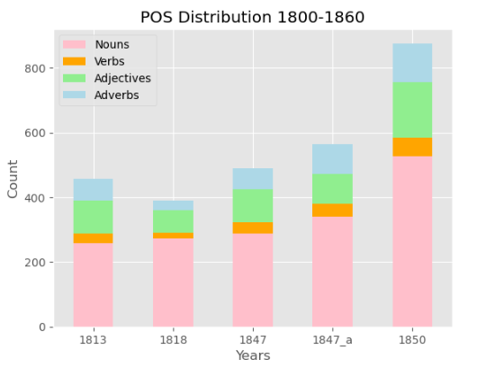

Analysis:
This stacked bar plot represents the counts of parts of speech from 1800 - 1860. Each color represents a part of speech,  pink for nouns, orange for verbs, green for adjectives, and blue for adverbs.The bars have different heights and that is because sentence length has changed throughout the time period. The total number of  nouns in a sentence has always been the highest and the total number of verbs has always been the lowest compared to other parts of speech. The variation of parts of speech in this era can be due to new vocabulary required for inventions such as transport, domestic appliances and industrial equipment, or for sporting, entertainment, and  cultural reasons. 

### Word Cloud 
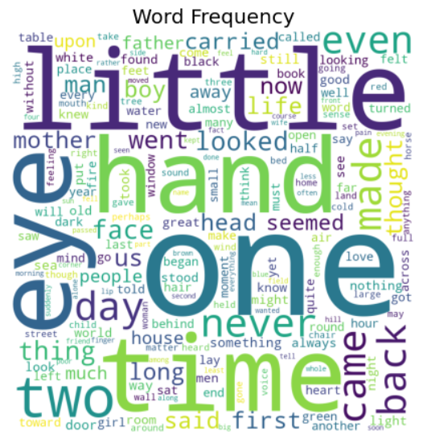

Analysis: 
A word cloud is an image made of words that together resemble a cloudy shape.
The size of a word shows its frequency. This word cloud shows the frequency of words throughout the eras that we are studying. The bigger and bolder the word appears, the more often it is mentioned within text and the more important it is. You can easily see that “little”, “hand”, “one”, “time” and “eye” have the most overall average of distribution from 1800 - present day.

### Dot PLot
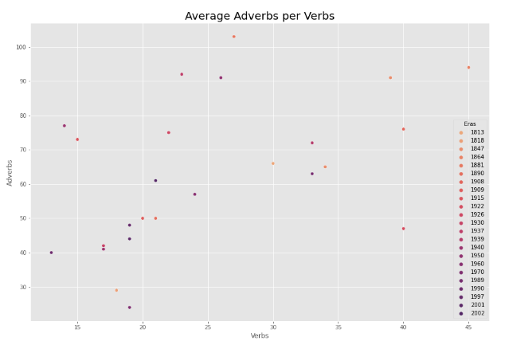

Analysis: 
This scatterplot shows the relationship between the amount of adverbs and verbs throughout the eras that we are studying. To get this graph, we calculated the average amount of adverbs and verbs used in a book representing an era and simply assigned verbs to the x axis and adverbs to the y axis. The plot points in the graph are fairly scattered throughout. Not only this but there seems to be no trend for if an era affects the adverb to verb ratio. This could be due to varying factors. One could be a small sample size. It is hard to extrapolate a trend from such a small amount of books. And of the books we chose, there are a lot of factors that differ between them such as writing style and audience. 

### Line Graph
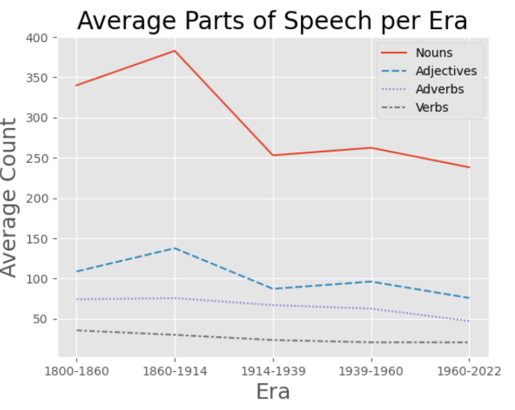

Analysis: 
The line plot displays the change in average usage of parts of speech throughout the five eras this study focused on. The red line, representing the average number of nouns used in literature throughout the time periods, significantly drops after the 1860-1914 time period. This could be due to any reason, including the historical events that were happening across the world during the early 1900s which significantly affected literature. The lines representing the average parts of speech usage for verbs and adverbs have remained consistent throughout the eras with a slight and gradual decrease over time. The line representing adjectives demonstrates a drop for the 1914-1939 era and a slight increase for the 1939-1960 era.

### POS Distribution 1960-Present
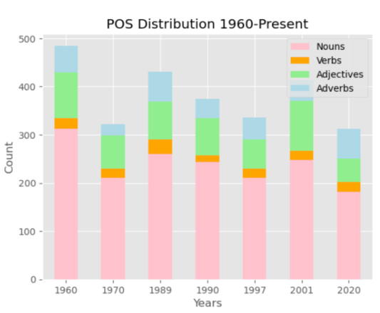

Analysis: 
The stacked bar plot represents the distribution for parts of speech from 1960 - present day. Each color represents a part of speech, with pink for nouns, orange for verbs, green for adjectives, and blue for adverbs. Looking at the pink section of each bar, the overall average use of nouns has always been the highest compared to other parts of speech and verbs make up for the least amount of words in a sentence from this time period. The bars are different sizes because sentence length varied throughout the time period. The variation in parts of speech throughout this era could be due to the change in topics that were popular in literature every decade. 

## Algorithms 
 

### KNN Algorithm
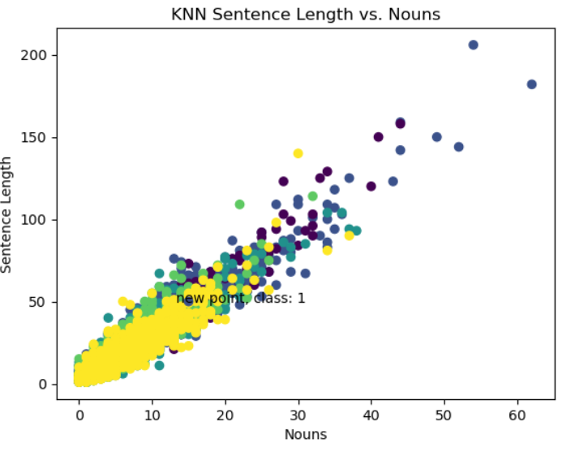

To create the KNN analysis for this dataset, we had to retrieve all the sentence lengths and the nouns per sentence for every book that we had used for this project. For every sentence entry we had to input a class that pertained to the era that the book is from. For example, the ‘Hobbit’ was made in 1937, so it pertained to the 1914-1939 era and would be classified as class 2. So once all the data was collected, it was put into a scatter plot. Once it is in, we use the KNN algorithm to predict the era that a new entry would be a part of by looking at the 100 closest neighbors. So for this algorithm, we used k = 100 as the plot had almost 5000 sentences/entries total. For the specific example shown, the unknown sentence inputted has 15 nouns and 50 words in its sentence. So the algorithm chooses the 100 closest neighbors and sees that the sentences/books closest to it are from the 1860s to the 1914s. Since the majority is of that era, the unknown point is predicted to have that era as well. From the scatter plot that depicts our data and the KNN algorithm, we can see that the prediction can be incredibly random. Almost all of the eras tend to stick around the same area with the sentence length varying from 0-100 and the amount of nouns being from 0-30. Perhaps the amount of sentence length and nouns are not a good indicator of what era a sentence from a novel would be from. 

### Naive Bayes’ Algorithm
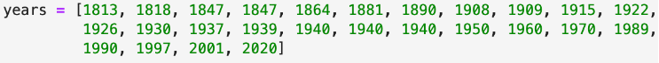

The code snippet above shows the order of the years that were studied in this project.

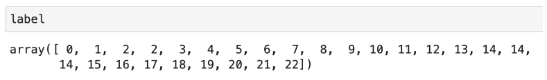

The code snippet above shows the encoded version of the years list for when the algorithm makes a prediction for what year a novel would have come out based on average sentence length and noun count.

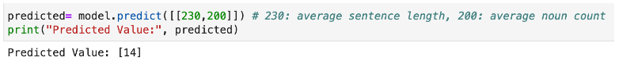

The code snippet above shows the prediction that was made from the Naive Bayes’ Algorithm where the year of the novel can be predicted when given the number for average sentence lengths and average use of nouns. The value 14 translates to 1940, as seen in the previous code snippets where 1940 was encoded to 14 three times.

### Linear Regression
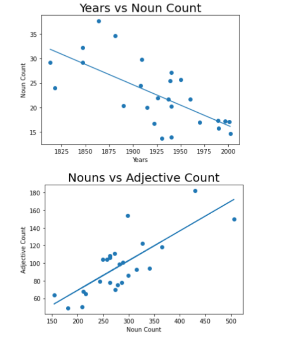

Analysis:
After looking at the spider charts, which show the number of different parts of speech in the first 50 sentences of each novel, I decided to look at the trends for nouns specifically, as well as nouns vs adjectives per sentence. As inferred from the spider charts, the relationship between nouns and adjectives is mostly consistent, as seen from the Nouns vs Adjective Count. Moreover, the number of nouns per sentence decreases linearly as years increase (Years vs Noun Count). 
These visualizations are mostly to quantify what is seen on a spider chart. From a spider chart we could see that the ratio of parts of speech to one another remained the same, but it is nearly impossible to ascertain that the relationship between nouns and adjectives is indeed linear and that the number of nouns decreases linearly with years. For the second graph, I specifically chose nouns vs adjectives since adjectives modify nouns in text, and their relationship is more indicative of a particular trend, than verbs vs. adjectives, for example. For the same reason, nouns play the role of an independent variable, and adjectives are dependent. 
Linear regression helps to see whether variables are strongly or weakly correlated, and while there is not a strong correlation between years and noun counts, there is a linear tendency to the overall shape. This lack of a stronger linear correlation may be due to a small sample.

## Conclusion:

Our initial hypothesis was that sentence length would decrease over time, as well as the average number of adjectives and adverbs per sentence. Indeed, average sentence length decreased by half between 1800 and 2022. While the numbers of all parts of speech in an average sentence decreased over time, the number of nouns decreased the most dramatically, from approximately 350 in the early 1800s to approximately 250 in the early 2000s. When drawing such conclusions, however, it is also important to take into account the number of samples. We were able to only have 1-3 samples for each year and some of the novels may not be very representative of the writing style during that era and, therefore, be an outlier.

